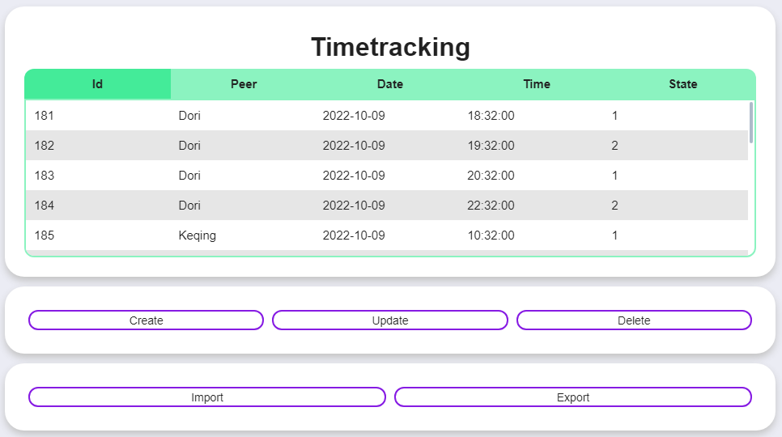
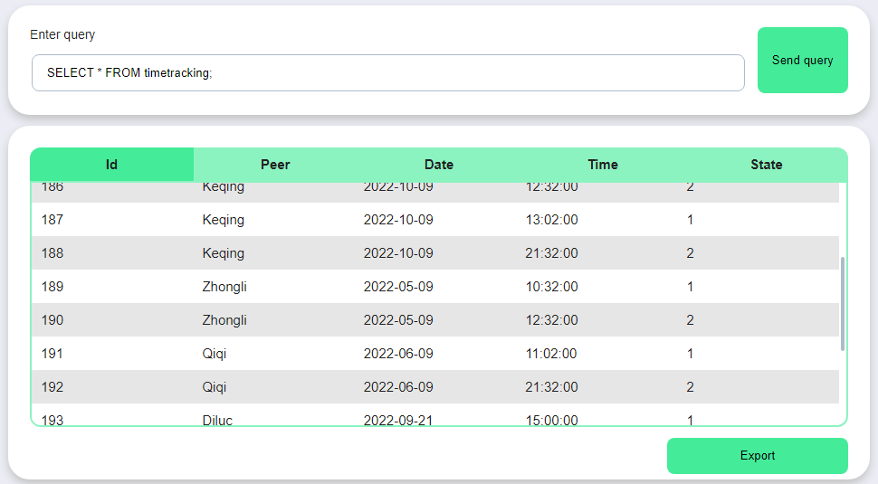

INFO 21
========
Реализация web-интерфейса для postgreSQL базы данных.  
Проект был выполнен вместе с (@vrivka)[https://github.com/vrivka] в рамках обучения в Школе 21.
Среди прочего можно выделить:  
- CRUD-операции
- Возможность ввода пользовательского sql-запроса
- Отображение + возможность использовать хранимые процедуры и функции
- Импорт таблиц из .csv
- Экспорт таблиц/результатов запроса/результатов функций в .csv

## Быстрый старт
1. Для установки зависимостей - `pip install -r requirements.txt`
2. Для запуска приложения на **http://127.0.0.1:5000** - `flask run` в папке project

## Меню
  
- `Home` и нажатие по логотипу отправляет на главную страницу с информацией о проекте и разработчиках.
- `Data` предоставит выбор таблицы для чтения, редактирования, импорта и экспорта
- `Operations` хранит в себе разделы `Custom query` и `Stored functions`

## Data
  
## Operations
### Custom query
  
### Stored functions
  

### Режимы
>[!IMPORTANT]
> Example

>[!NOTE]
> Example

## Завершение
Благодарим читателя за интерес к проекту, будем рады вашему фидбеку.
