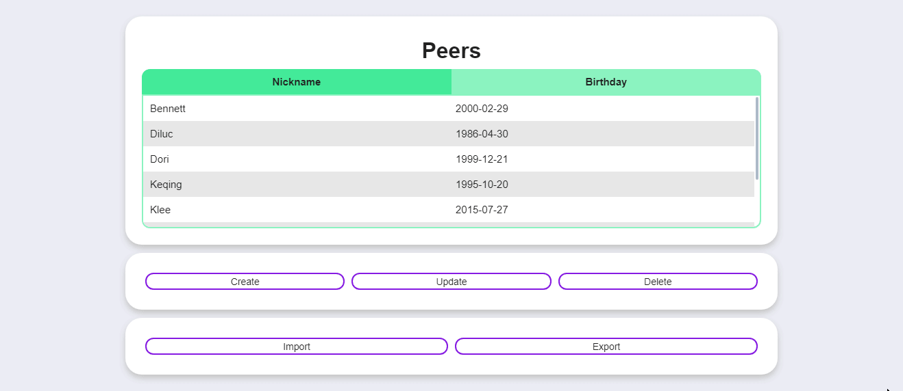

INFO 21
========
Реализация web-интерфейса для postgreSQL базы данных.  
Проект был выполнен вместе с [vrivka](https://github.com/vrivka/) в рамках обучения в Школе 21.  
Среди прочего можно выделить:  
- CRUD-операции
- Возможность ввода пользовательского sql-запроса
- Отображение и возможность использовать хранимые процедуры/функции
- Импорт таблиц из .csv
- Экспорт таблиц/результатов запроса/результатов функций в .csv

## Старт
>[!IMPORTANT]
> Для работы с проектом необходимо заполнить базу данных (например, файлами из директории database).  
> Также нужно добавить файл **.env** в директорию **project** с указанием переменных для установки соединения с бд:  
(DATABASE, POSTG_USER, POSTG_PASW, POSTG_HOST и POSTG_PORT)

1. Для установки пакетов - `pip install -r requirements.txt`
3. Для запуска приложения на **http://127.0.0.1:5000** - `flask run` в директории **project**

## Описание с примерами

### Menu
  
- `Home` и нажатие по логотипу отправляет на главную страницу с информацией о проекте и разработчиках.
- `Data` предоставит выбор таблицы для чтения, редактирования, импорта и экспорта
- `Operations` хранит в себе разделы `Custom query` и `Stored functions`

### Data 
  
### Custom query
  
### Stored functions
  

>[!NOTE]
> Во всех полях ввода стоит защита от SQL-инъекций.

## Завершение
Благодарим читателя за интерес к проекту, будем рады вашему фидбеку.
